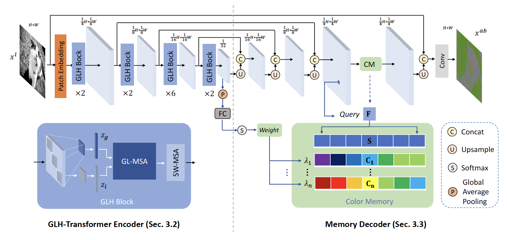

# ColorFormer: Image Colorization via Color Memory assisted Hybrid-attention Transformer

This is the implementation of ``ColorFormer: Image Colorization via Color Memory assisted Hybrid-attention Transformer'' (ECCV22)



This repository is heavily based on  [BasicSR](https://github.com/xinntao/BasicSR).

## Requirements
- pytorch==1.9.0
- torchvision
- scikit-image
- einops
- timm

Please run this to install basicsr.
```
python3 setup.py develop
```


## Inference
```
python3 inference/inference_parallel.py --input /path/to/input --output /path/to/output --model_path /path/to/model checkpoint file
```


## Train
1. Download imagenet training set from https://www.image-net.org/, then list all the image paths in a txt file.
2. Specify 'meta_info_file' in options/train/ECCV22/train_colorformer.yml
3. To collect semantic and color priors, run
```
python3 memory_build/inference_GLH.py --input_txt image_paths.txt
python3 memory_build/semantic_color_clustering.py
```
1. For multi-gpu training, run
```
sh scripts/train.sh
```


We thank the authors of [BasicSR](https://github.com/xinntao/BasicSR) as we train colorformer based on the awesome training pipeline.

> Xintao Wang, Ke Yu, Kelvin C.K. Chan, Chao Dong and Chen Change Loy. BasicSR: Open Source Image and Video Restoration Toolbox. https://github.com/xinntao/BasicSR, 2020.
